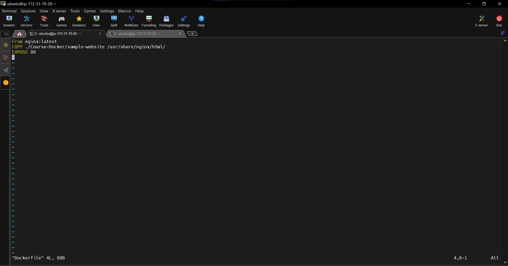
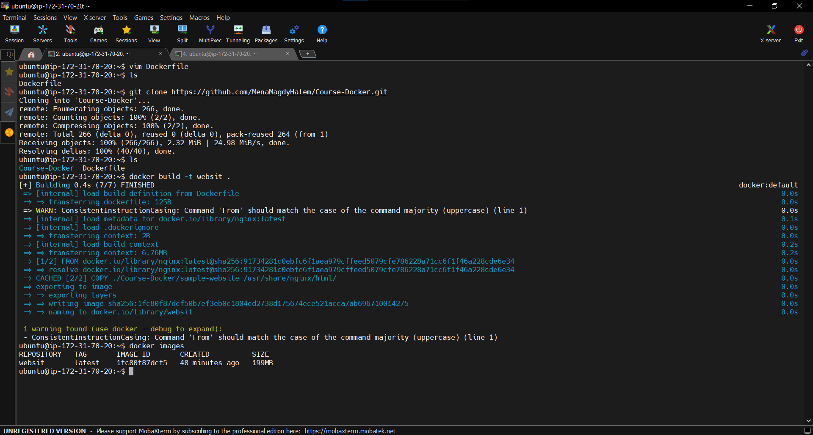
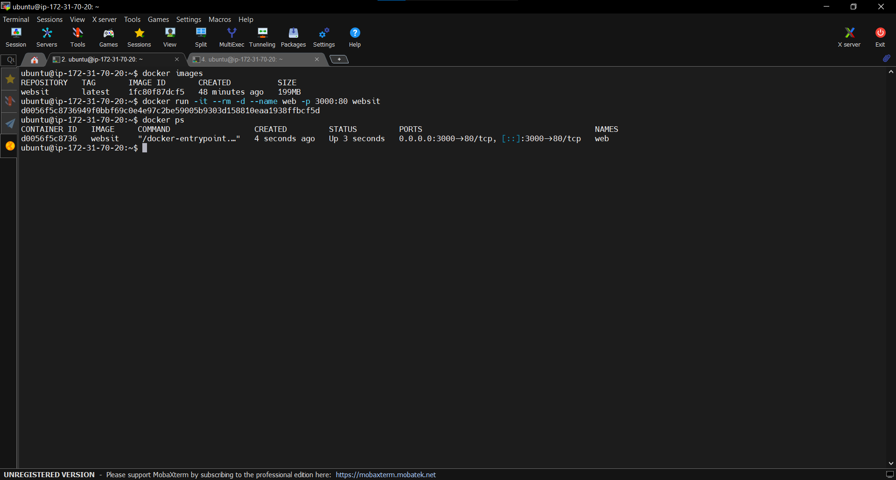
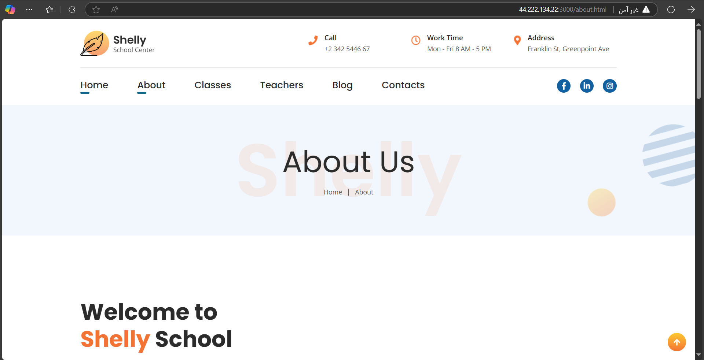
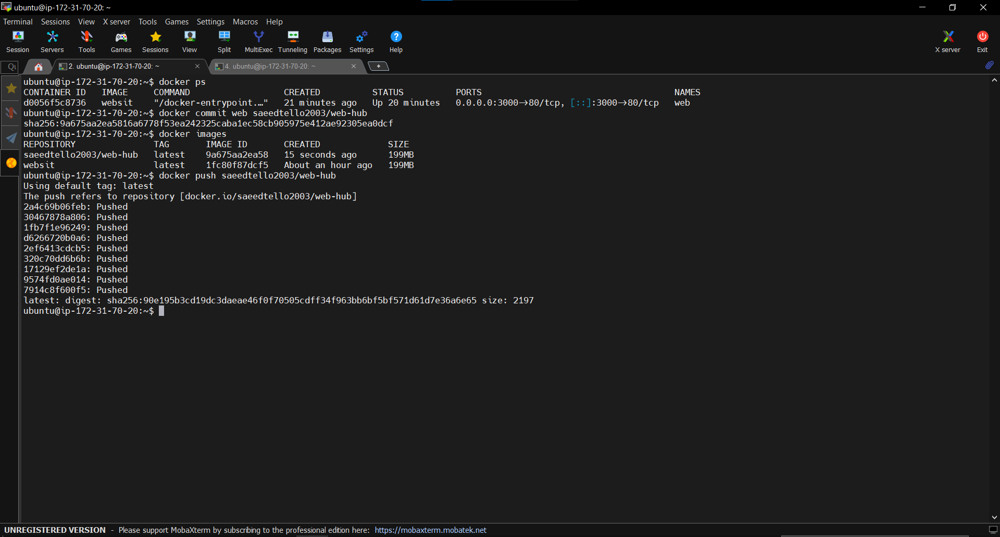
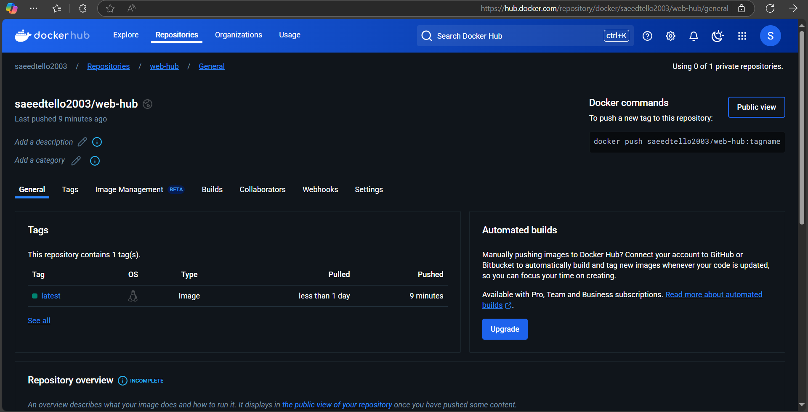

# Dockerized Nginx Website

This repository contains a Dockerized version of an Nginx-based static website. The project demonstrates how to containerize a simple web application, run it inside a Docker container, and push the built image to Docker Hub.

## Project Overview
- Cloned a GitHub repository containing website files.
- Created a Dockerfile to build a custom Nginx image.
- Built and ran a Docker container, exposing the site on port 3000.
- Verified the website’s functionality.
- Committed the running container as a new Docker image and pushed it to Docker Hub.

## Architecture
The project structure is as follows:

```
/home/ubuntu/
│── Course-Docker/        # Cloned GitHub repository (website files)
│── Dockerfile           # Docker instructions (inside /home/ubuntu)

```

## Setup Instructions
### Prerequisites
Ensure you have the following installed:
- **Docker** → [Installation Guide](https://docs.docker.com/get-docker/)

### Step 1: Clone the Repository
```bash
git clone https://github.com/SaaedT/Course-Docker.git
cd Course-Docker
```

### Step 2: Build the Docker Image
```bash
docker build -t website .
```
📸 Screenshot:


### Step 3: Verify Directory Structure
```bash
ls -l /home/ubuntu/
```
📸 Screenshot:


### Step 4: Run the Container
```bash
docker run -it --rm -d -p 3000:80 --name web website
```
- `-d` → Runs the container in detached mode.
- `-p 3000:80` → Maps port 3000 on your machine to port 80 inside the container.

📸 Screenshot:


### Step 5: Verify the Website
The website is hosted inside the Docker container. Below is a screenshot showing the website running successfully:

📸 Screenshot:



### Step 6: Save the Running Container as an Image
```bash
docker commit web saeedtello2003/website
```

### Step 7: Tag and Push to Docker Hub
```bash
docker push saeedtello2003/website:v1
```
📸 Screenshot:


### Step 8: Verify on Docker Hub
Log in to your Docker Hub account and confirm that the image has been successfully uploaded.

📸 Screenshot:


## Clean Up
To stop and remove the running container, use the following commands:
```bash
docker stop web
docker rm web
docker rmi website
```

## Docker Hub Image
The final Docker image is available on Docker Hub:
🔗 **[saeedtello2003/website](https://hub.docker.com/r/saeedtello2003/website)**

## Author
- **GitHub**: [SaaedT](https://github.com/SaaedT)
- **Docker Hub**: [saeedtello2003](https://hub.docker.com/u/saeedtello2003)

✅ This repository documents the entire process of building, running, and deploying a Dockerized Nginx web application.
Feel free to contribute, raise issues, or fork the repository! 🚀

